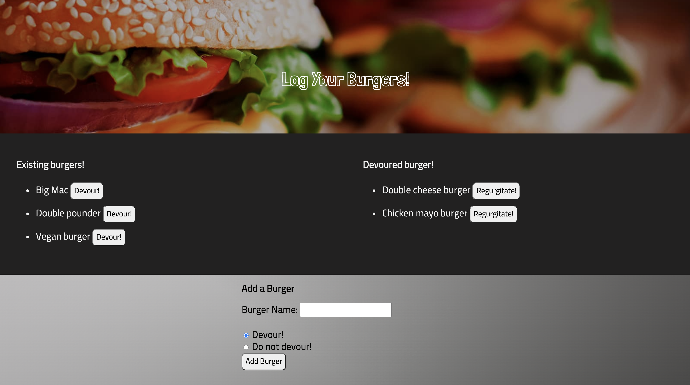

# Burger Logger
  

  ## Preview
  

  ## Description
  * Burger Logger is a restaurant app that allow users to enter their favourite burger name.

  ## Deployed application
  https://serene-hamlet-38122.herokuapp.com/

  ## Technologies used
  HTML, CSS, JavaScript, Node.js, Express, Express handlebars, mySQL

  ## Table of Contents
  * [Installation](#installation)
  * [Usage](#Usage)
  * [License](#License)
  * [Contributing](#Contributing)
  * [Questions](#Questions)

  ## Installation
  To install necessary dependencies, run the following command:

      npm i

  ## Usage
  1. Fork this repository to your folder and install dependencies.
  2. Run `node server.js` in Node.js.
  3. Goto `connection.js` file under `config` folder, and then change host, user, password, and database details. 
  4. Go to your localhost in browser, and start using the app.

Alternatively, to use this app directly, click [here](https://serene-hamlet-38122.herokuapp.com/). You can add your favourite burgers to the list and devour it!

  ## License
  * MIT

  ## Contributing
  The app is contributed by Melody Lo and Trilogy Education Services.

  ## Questions
  * If you have any questions, feel free to contact me via email: yiling.melody.lo@gmail.com
  * My GitHub profile: https://github.com/roukell

  
  